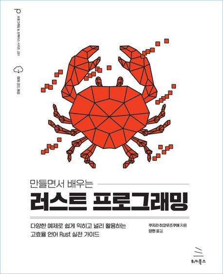
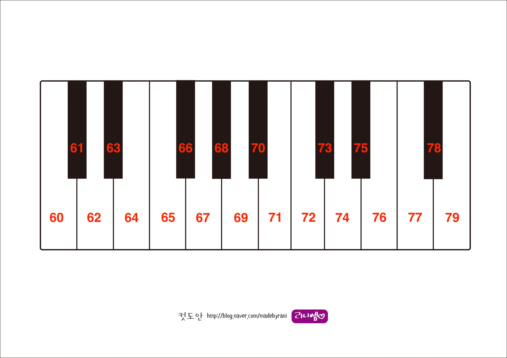
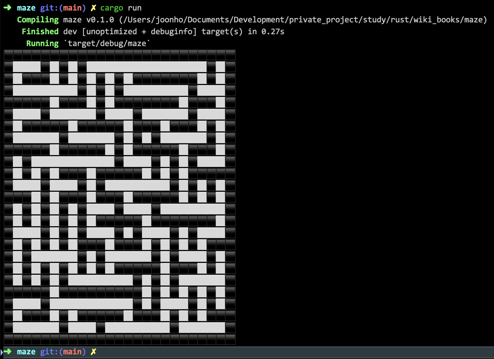

[만들면서 배우는 러스트 프로그래밍](https://product.kyobobook.co.kr/detail/S000200551107)<br>


* **쿠지라 히코우즈쿠**에 지음
* **양현** 옮김

# cargo test시 `println!` 출력 방법

`$ cargo test -- --nocapture`

# println! macro format
**205page** 내용 정리

| 서식 | 설명 | 사용 예 |  입력 | 결과 | 비고 |
|---|---|---|---|---|---|
| `{:<n}` | n자리 왼쪽 정렬 | \_{:<5}\_ | 30 | **\_30&nbsp;&nbsp;&nbsp;\_** ||
| `{:>n}` | n자리 오른쪽 정렬 | \_{:>5}\_ | 30 | **\_&nbsp;&nbsp;&nbsp;30\_** ||
| `{:^n}` | n자리 가운데 정렬 | \_{:^5}\_ | 3 | **\_&nbsp;&nbsp;3&nbsp;&nbsp;\_** ||
| `{:a^n}` | n자리 가운데 정렬 후 a로 채움 | \_{:^10}\_ | 30 | **\_aaaa30aaaa\_** | 추가 |
| `{:0<n}` | n자리 왼쪽 정렬 후 0으로 채움 | \_{:0<5}\_ | 12 | **\_12000\_** ||
| `{:a>n}` | n자리 오른쪽 정렬 후 a로 채움 | \_{:a>5}\_ | 12 | **\_aaa12\_** | 변경 |
| `{:b}` | 2진수 | {:b} | 4 | 100 ||
| `{:0nb}` | 2진수에서 n만큼 0으로 채움 | {:08b} | 4 | **00000100** ||
| `{:o}` | 8진법 | {:o} | 438 | **666** ||
| `{:x}` | 16진법 | {:x} | 255 | **ff** ||
| `{:0nx}` | 16진수에서 n만큼 0으로 채움 | {:04x} | 255 | **00ff** | 변경 |
| `{:.n}` | 소수점 이하 n자리 표시 | {:.2} | 3.141592 | **3.14** ||
| `{:e}` | 지수 표시 | {:e} | 12.34 | **1.234e1** ||
| `{:?}` | 디버그 출력 | {:?} | [1, 2, 3] | [1, 2, 3] ||
| `{:#?}` | 디버그 출력(형태 정렬) | {:#?} | [1, 2, 3]| **[<br>&nbsp;&nbsp;&nbsp;&nbsp;1,<br>&nbsp;&nbsp;&nbsp;&nbsp;2,<br>&nbsp;&nbsp;&nbsp;&nbsp;3<br>]** | 변경 |
| `{{` | 중괄호(`{`) 출력 | {{ | | **{** ||
| `}}` | 중괄호(`}`) 출력 | }} | | **}** ||
| `{:p}` | 포인터(주소) 출력 | {:p} | abc | 예) 0x10e942f94 ||
| `\"` | 큰따옴표(`"`) 출력 | \"| | **"** ||
| `\\` | 역슬래시(`\`) 출력 | \\ | | **\\** ||

# 문자열 자르기
**247page** 내용 정리

<dl>
	<dt>split_at</dt>
	<dd>인자로 주어지는 position(index) - 1 위치를 기준으로 분리하여 <code>(&str, &str)</code> 형태로 반환</dd>
	<dt>split_off</dt>
	<dd>인자로 주어지는 position(index) - 1 위치를 기준으로 이후 문자열을(<code>String</code>) 반환</dd>
</dl>

```rust
let telno = "032-123-4567";

// -------------------------------
// split_at(index + 1)
// -------------------------------
// 032-123-4567 => 032-124, -4567
// ______^
let (temp, telno3) = telno.split_at(7);

// 032-123 => 032, -123
// __^
let (telno1, telno2) = temp.split_at(3);

// -------------------------------
// split_off(index + 1)
// -------------------------------
let mut temp = telno.to_string();
// 032-123-4567 => 4567
// _______^
let telno3 = temp.split_off(8);
// 032-123- => 123-
// ___^
let telno2 = temp.split_off(4);
```

# unsafe

`unsafe`로 정의된 함수는 해당 함수를 호출하는 쪽에도 동일하게 `unsafe` 블럭으로 감싸주어야 한다.

```rust
unsafe fn function() {
	// ...
}

fn main() {
	unsafe {
		function();
	}
}
```

# 반복자 반환 함수 관련

| 함수 | 설명 | 소유권 이동 |
|---|---|---|
| `iter` | 배열 혹은 벡터 요소의 참조자(`&T`)를 반환 | 소유권은 이동하지 않음 |
| `iter_mut` | 배열 혹은 벡터 요소의 가변 참조자(`&mut T`)를 반환 | 소유권은 이동하지 않음 |
| `into_iter` | 배열 혹은 벡터 요소의 값(`T`)을 반환 | **소유권 이동됨** |

기본 타입(i32, f64, &str 등)이 아닌 타입에 `for`문 사용시 명시하지 않을 경우 암묵적으로 `into_iter()`가 자동으로 호출됨. 따라서 책의 설명과 같이 다음과 같이 `iter()`를 명시적으로 호출해야 함.

```rust
let arr1: [String; 4] = [
    "Apple".to_string(),
    "Banana".to_string(),
    "Mango".to_string(),
    "Tomato".to_string(),
];
let mut arr2: [String; 3] = [
    "Apple".to_string(),
    "Banana".to_string(),
    "Mango".to_string(),
];
let arr3: [u8; 3] = [1, 2, 3];
let arr4: [&str; 2] = ["Hello", "world"];

// for a in arr {} 사용시 소유권 관련 오류 발생
for a in arr1.iter() {
    println!("{:?}", a);
}

for a in arr2.iter_mut() {
    a.push_str(" universe");

    println!("{}", a);
}

for a in arr3 {
    println!("{:?}", a);
}

for a in arr4 {
    println!("{:?}", a);
}
```

# Workspace

다중 rust crate를 하나의 package로 묶고 전체를 일괄 빌드(테스트 등 포함) 할 수 있다.

```
|- api
|  |-src
|  |-Cargo.toml
|
|- application
|  |-src
|  |-Cargo.toml
|
|- domain
|  |-src
|  |-Cargo.toml
|-Cargo.toml
```

하위 crate의 `Cargo.toml`은 일반적인 형식과 비슷하며, 상호 crate간 의존성이 있는 경우 다음과 같은 형태를 가진다.

```toml
# api/Cargo.toml
[package]
name = "api"
version = "0.1.0"
edition = "2018"

[dependencies]
application = {path = "../application"}
domain = {path = "../domain"}
```

최상위 `Cargo.toml`파일은 workspace section이 존재하며 다음의 형식을 가진다.

```toml
[workspace]
members = [
    "api",
    "application",
    "domain"
]
```

`maven`의 sub module과 동일한 개념.

# image checker board


# image resize by filter

| filter | 결과물 | filter | 결과물 |
|:---:|---|:---:|---|
| `imageops::Nearest` |  | `imageops::Triangle` |  |
| `imageops::CatmulRom` |  |`imageops::Gaussian` |  |
| `imageops::Lanczos3` |  | |

# image_filter(색상 반전)


# 80년대 음원 만들기(동요 `똑같아요` 추가)



* 톱니파<br>
<audio src="./md_img/same_saw.wav?raw=true" controls loop="false" preload="auto" />
* 방형파<br>
<audio src="./md_img/same_square.wav?raw=true" controls loop="false" preload="auto" />
* 삼각파<br>
<audio src="./md_img/same_tri.wav?raw=true" controls loop="false" preload="auto" />
* 펄스파<br>
    * duty 0.1<br>
    <audio src="./md_img/pulse_same_0.1.wav?raw=true" controls loop="false" preload="auto" />
    * duty 0.3<br>
    <audio src="./md_img/pulse_same_0.3.wav?raw=true" controls loop="false" preload="auto" />
    * duty 0.5<br>
    <audio src="./md_img/pulse_same_0.5.wav?raw=true" controls loop="false" preload="auto" />
    * duty 0.7<br>
    <audio src="./md_img/pulse_same_0.7.wav?raw=true" controls loop="false" preload="auto" />
* FM 음원<br>
    * 매개변수 4.5, 2.0<br>
    <audio src="./md_img/fm_4.5_2.0.wav?raw=true" controls loop="false" preload="auto" />
    * 매개변수 7.0, 3.0<br>
    <audio src="./md_img/fm_7.0_3.0.wav?raw=true" controls loop="false" preload="auto" />
    * 매개변수 3.0, 2.0<br>
    <audio src="./md_img/fm_3.0_2.0.wav?raw=true" controls loop="false" preload="auto" />
    * 매개변수 11.0, 4.0<br>
    <audio src="./md_img/fm_11.0_4.0.wav?raw=true" controls loop="false" preload="auto" />

# 스마트 포인터 타입 특징

| 스마트 포인터 | 공유 | 값 변경 | 설명 |
|---|:---:|:---:|---|
| `Box<T>` | X | O | 힙 영역에 T의 메모리 확보 |
| `Rc<T>` | O | X | 힙 영역에 공유 가능한 T의 메모리 확보 |
| `RefCell<T>` | X | O | 실행할 때 빌림 규칙을 강제 |
| `Rc<RefCell<T>>` | O | O | 힙 영역에 공유 가능하고 수정 가능한 T의 메모리 확보 |

# 확인 필요

* [ ] Chapter 2의 미로 생성(110 페이지)에서 생성된 미로는 진입할 수 없는 문제가 있음<br>


## 간이 채팅 프로그램 만들기

* 408 ~ 409 page 소스 중 `send_all` 함수를 다음과 같이 구현 해도 정상 작동함(소유권 이전하지 않음)<br>

```rust
use std::net::TcpStream;

// --------------------------------------------------------
// 책의 예제
// --------------------------------------------------------
fn send_all(clients: Vec<TcpStream>, s: &str) -> Vec<TcpStream> {
    let mut collector = vec![];
    for mut socket in clients.into_iter() {
        // 문자열을 바이트열로 변환해 전송
        let bytes = String::from(s).into_bytes();
        if let Err(e) = socket.write_all(&bytes) {
            println!("전송 에러 : {}", e);
            continue;
        }
        collector.push(socket); // 소유권 회수
    }
    collector // 소유권 반환
}
```
```rust
// --------------------------------------------------------
// 수정
// --------------------------------------------------------
fn send_all(clients: &Vec<TcpStream>, msg: &str) {
    for mut socket in clients.iter() {
        let bytes = String::from(msg).into_bytes();

        if let Err(e) = socket.write_all(&bytes) {
            println!("전송 에러 : {:?}", e);

            continue;
        }
    }
}
```